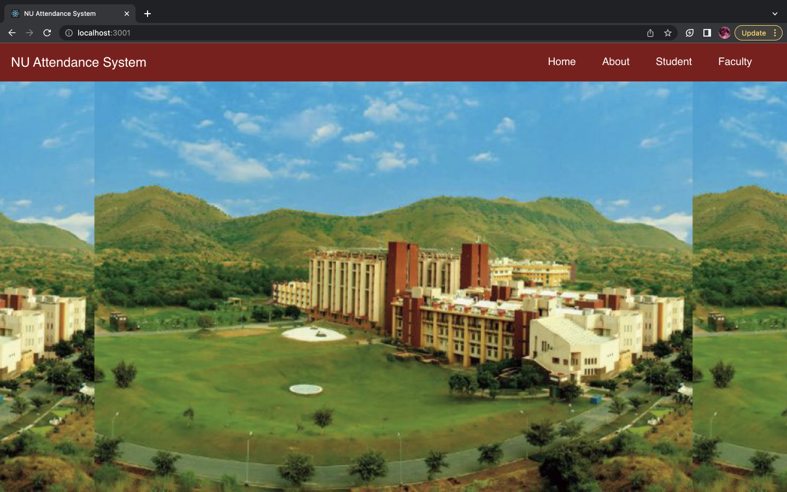

  <h1 align="center">Face Recognition Attendance System</h1>
  <h1 align="center"> NIIT University - Capstone Project</h1>

<!-- TABLE OF CONTENTS -->

  
Table of Contents

  <ol>
    <li>
      <a href="#about-the-project">About The Project</a>
      <ul>
        <li><a href="#salient-features">Salient Features</a></li>
        <li><a href="#compatible-platforms">Compatible Platforms</a></li>
        <li><a href="#built-with">Built With</a></li>
      </ul>
    </li>
    <li>
      <a href="#agile-methodology">Agile Methodology</a>
      <ul>
        <li><a href="#what-is-agile">What is Agile</a></li>
        <li><a href="#how-i-incorporated-agile-methodology-during-the-development-cycle">How I Incorporated Agile Methodology During The Development Cycle</a></li>
      </ul>
    </li>
    <li>
      <a href="#getting-started">Getting Started</a>
      <ul>
        <li><a href="#points-to-remember-while-testing-the-app">Points to remember while testing the app</a></li>
        <li><a href="#before-installation">Before Installation</a></li>
        <li><a href="#installation">Installation</a></li>
      </ul>
    </li>
    <li><a href="#navigating-through-the-app">Navigating through the App</a></li><ul>
        <li><a href="#home-page-and-about-section">Home page and About Section</a></li>
        <li><a href="#student-and-faculty-registration">Registration</a></li>
        <li><a href="#student-and-faculty-login">Login</a></li>
        <li><a href="#student-and-faculty-profile-page">Profile Page</a></li>
        <li><a href="#generate-code-and-send-email">Generate Code and Send Email</a></li>
        <li><a href="#authenticate-code-and-mark-attendance">Marking Attendance</a></li>
        <li><a href="#view-daily-and-datewise-attendance-sheet">Attendance Sheet</a></li>
        <li><a href="#chatbox-feature">ChatBox</a></li>
      </ul>
    <li><a href="#need-help">Need Help?</a></li>
  </ol>

<!-- ABOUT THE PROJECT -->

## About The Project
* This project is made as a part of the Capstone Project for Semester VI of 2020 Batch.
* The project uses the facial recognition technology to mark the attendence of students.
* The project aims to eliminate the current conventional attendance system which is done manually. 
* It detects and matches student face to mark attendance automatically.
* The faculty generates the unique authentication code which is validated on student side to mark attendance.

### Salient Features
* Capturing student image at the time of registration later used to detect face and mark attendance.
* Sending class details email using Nodemailer, editing profile, viewing daily and date-wise attendance sheet as well as the no. of lectures and percentage attendance of each student.
* Sending email automatically to all students absent for the class.
* ChatBox - Feature through which the student and faculty can directly chat with each other implemented using Socket.io
* Dynamic Profile page of Student and faculty showing all their details.

### Compatible Platforms
Laptops, Desktops and Tablet PCs

### Built With
* ![Front-end][front-end-shield]
* ![Back-end][back-end-shield]
* ![Database][database-shield]
* ![Tools][tools-shield]

<!-- APP TUTORIAL-->
## Navigating Through The App

## Home Page and About Section

   - Home Page of the website. The project is divided into two modules - Student and Faculty.
   
    
   
   - About Section. The project provides face scanning to mark attendance and is very User friendly.
   
   
   
## Student and Faculty Registration

   - Faculty Registration form. The faculty needs to fill in the details and register. The passwords will be validated.
   
   
   
   - Student Registration form. The student needs to fill the details and capture image which will be stored and used later to mark attendance. The passwords are validated.
   
   
   
   
## Student and Faculty Login

   - Faculty Login page. The credentials need to match to login and the authentication is done using JSON Web Token.
   
   
   
   - Student Login page. The credentials need to match to login and the authentication is done using JSON Web Token.
   
   
   
## Student and Faculty Profile Page

   - Faculty Profile Page showing all the data dynamically. The faculty can also Edit Profile if he wants. He can generate code, view daily and datewise attendance sheet and also chat with the students.
   
   
   
   - Student Profile Page showing all the data dynamically along with his image. The Student can also Edit Profile if he wants and enter the authentication code to mark attendance as well as chat with the faculty.
   
   
   
## Generate Code and Send Email

   - The faculty can enter the subject and generate unique authentication code for the student to mark attendance. After generating code a Send Email button appears through which he can automatically share the class details to all the students of the department.
   
   
   
   - Email sent to all the students of the department through Nodemailer.
   
   
   
## Authenticate Code and Mark Attendance

   - The student needs to mark the attendance by entering the subject and the code sent by the faculty.
   
   - The student needs to enter correct code.
   
   
   
   - The code will be valid for only 2 minutes and the student has to mark attendance. If a student tries to mark attendance after 2 minutes the attendance will not be marked.
   
   
   
   - If a student enters correct code , a webcam will open will will detect and match student face and automatically mark attendance.
   
   
   
   
   
## View Daily and DateWise Attendance Sheet

   - The faculty can view the daily attendance of all the students of the department.
   
   
   
   - He can also automatically send an email to all the students who were absent for the class.
   
   
   
   - The faculty can view the date-wise attendance, from-date to to-date by entering the subject. It also shows the no. of lectures attended by each student as well as their percentage attendance.
   
   
   
## ChatBox Feature

   - ChatBox feature implemented using Socket.io

   - The faculty can directly chat with any student of his department. A list of all students of the department appears in the ChatBox. The previous chats are retained using MongoDB.
   
   
   
   - Similarly, the student can also directly chat with any faculty of his department. A list of all faculty members of the department appears in the ChatBox. The previous chats are retained using MongoDB.
   
   
   
   - The student and the faculty can now chat with each other with previous chats retained.
   
   

<!--MARKDOWN LINKS-->
[front-end-shield]: https://img.shields.io/badge/Front--end-React%20JS-blueviolet
[back-end-shield]: https://img.shields.io/badge/Back--end-Node%20JS%2C%20Express%2C%20socket.io-blueviolet
[tools-shield]: https://img.shields.io/badge/Tools-JavaScript%20FaceAPI-blueviolet
[database-shield]: https://img.shields.io/badge/Database-MongoDB-blueviolet
